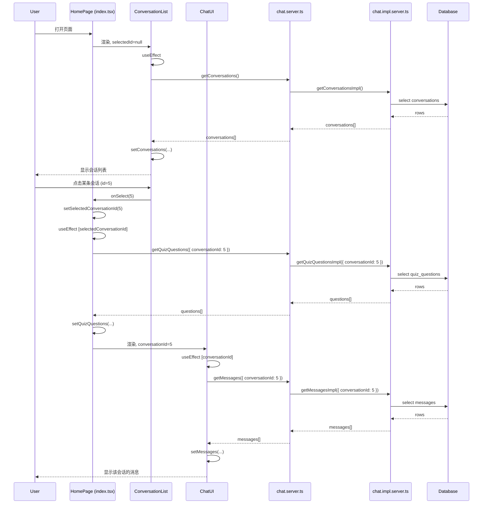
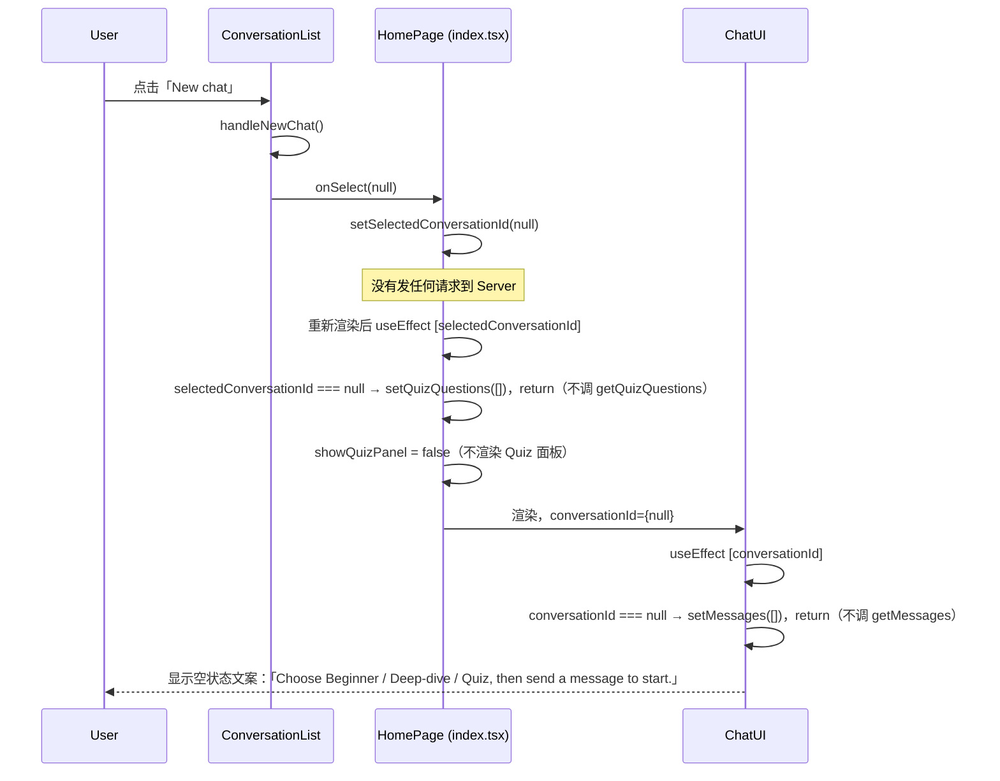
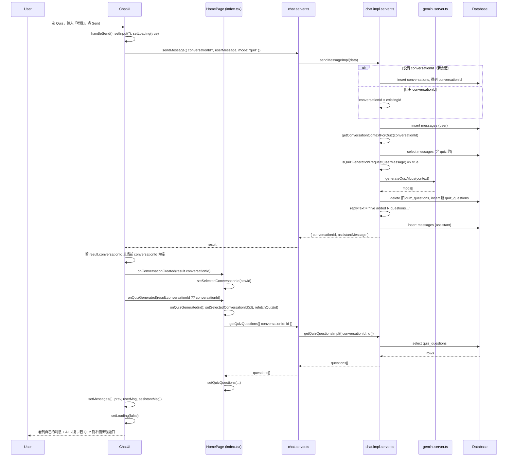
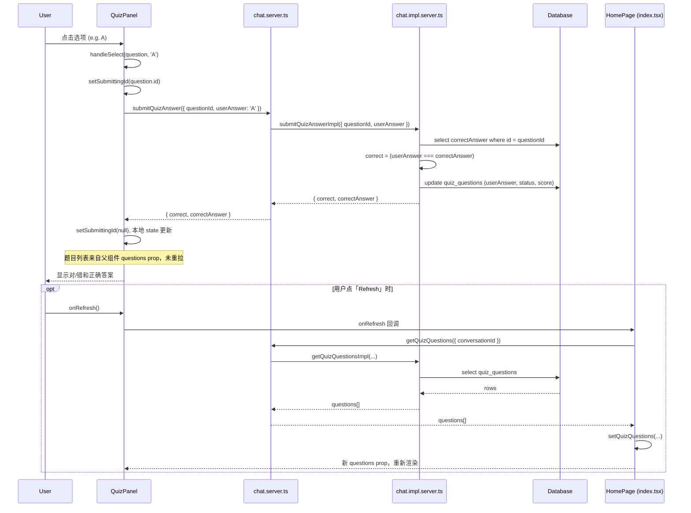

# Onboarding: 数据流与架构说明

这个是quizMode刚实现好的状态。
给新人看的文档：用「谁调谁、数据怎么走」的方式说明当前前后端逻辑，并配上 Mermaid 图。所有出现的**函数名**都会在文末列成表，方便你全局搜索。

---

## 1. 整体架构（三层）

```
┌─────────────────────────────────────────────────────────────────────────┐
│  前端 (React)                                                            │
│  index.tsx (HomePage) → ConversationList / ChatUI / QuizPanel           │
└───────────────────────────────────┬─────────────────────────────────────┘
                                    │ useServerFn(...) 调用
                                    ▼
┌─────────────────────────────────────────────────────────────────────────┐
│  服务端入口 (RPC)                                                        │
│  chat.server.ts: getConversations, getMessages, getQuizQuestions,        │
│                 submitQuizAnswer, sendMessage                            │
└───────────────────────────────────┬─────────────────────────────────────┘
                                    │ 动态 import 后调用
                                    ▼
┌─────────────────────────────────────────────────────────────────────────┐
│  服务端实现 + 外部服务                                                   │
│  chat.impl.server.ts: getConversationsImpl, getMessagesImpl, ...         │
│  gemini.server.ts: generateReply, generateQuizMcqs                      │
│  db (Drizzle)                                                           │
└─────────────────────────────────────────────────────────────────────────┘
```

- **前端**只认识 `chat.server.ts` 里导出的那几个 Server Fn，不直接碰 DB 或 Gemini。
- **chat.server.ts** 只做「校验入参 + 动态 import impl + 调 impl」，不写业务。
- **chat.impl.server.ts** 里才是真正的业务：读 DB、调 `generateReply` / `generateQuizMcqs`，再写回 DB。

---

## 2. Mermaid：页面与「选会话」数据流

用户打开首页 → 左侧列出会话 → 点某条会话 → 中间/右侧显示该会话的消息和（若有）Quiz。



要点：

- **ConversationList** 只负责「拉会话列表」和「把选中的 id 交给父组件」：`getConversations` → `getConversationsImpl`。
- **HomePage** 持有 `selectedConversationId`。一旦变化：
  - 会调 `getQuizQuestions`（通过 `getQuizQuestionsFn`）拉该会话的题目，并 `setQuizQuestions`。
  - 把 `conversationId={selectedConversationId}` 传给 **ChatUI**。
- **ChatUI** 根据 `conversationId` 拉消息：`getMessages` → `getMessagesImpl`，然后 `setMessages` 渲染。

**正确逻辑（逐步，可作自查）**

1. 用户打开首页（如 `http://localhost:3000/`）。**ConversationList** 挂载后，其 **useEffect**（依赖 **fetchConversations**）执行，调用 **fetchConversations**（即 server 的 **getConversations**）→ **getConversationsImpl** 从 DB 拉会话列表，成功后 **setConversations**，列表显示在左侧。
2. 用户点击其中一条会话 → 列表里该条按钮的 **onClick** 执行 **onSelect(c.id)**，把该会话的 **id** 传给 **onSelect**。ConversationList 的 Props 里 `onSelect: (id: number | null) => void`，即不返回值的回调。
3. **onSelect** 实际是父组件传下来的 **setSelectedConversationId**，所以这里执行的是 **setSelectedConversationId(id)**，父组件 **HomePage** 的 state **selectedConversationId** 被更新为这个 id（不是「id 直接传到父组件某一行」，而是「用 id 调了一次 setState」）。
4. 父组件重渲染后，**selectedConversationId** 通过 props 传下去：**selectedId** 传给 ConversationList，**conversationId** 传给 ChatUI。
5. **选会话后会有两条线同时发生**：  
   - **HomePage** 的 **useEffect** 依赖 **selectedConversationId**，会执行 **getQuizQuestionsFn**（即 **getQuizQuestions**）拉该会话的题目，**setQuizQuestions**，若有题则右侧 Quiz 面板显示。  
   - **ChatUI** 收到的 **conversationId** 这个 prop 变了，其 **useEffect** 依赖 **conversationId** 会执行，调用 **getMessagesFn**（即 **getMessages**）→ **getMessagesImpl** 拉该会话的消息，**setMessages**，中间区域渲染出该会话的消息列表。
6. 用户在 ChatUI 输入并点 **Send** → **handleSend** 里调 **sendMessageFn**（即 **sendMessage**，不是 getMessages）。服务端 **sendMessageImpl**：先 **INSERT** 用户消息（user role）到 **messages** 表；再按 **mode** 分支。若为 **quiz**，先 **getConversationContextForQuiz** 拿「非 quiz 消息」拼成的 **context**；若 **context.trim() 为空**（会话里还没有学习对话），则只调 **generateReply** 做普通回复、**不出题**；否则若 **isQuizGenerationRequest(userMessage)** 为真则调 **generateQuizMcqs**、删旧 **quiz_questions**、**INSERT** 新题，回复文案为 "I've added N questions..."，否则同样 **generateReply**。非 quiz 模式则拼 history 后 **generateReply**。最后 **INSERT** assistant 消息，**return** `{ conversationId, assistantMessage }`。
7. **ChatUI** 拿到 **result** 后：若是 Quiz 模式，调用 **onQuizGenerated(result.conversationId ?? conversationId ?? undefined)**。**onQuizGenerated** 是父组件 index 传下来的回调（index 里 52–60 定义）；父组件在该回调里 **setSelectedConversationId(id)** 并 **refetchQuiz(id)**。**refetchQuiz**（index 里 40–45 定义）内部调 **getQuizQuestionsFn** 拉该会话题目并 **setQuizQuestions**，父组件 state **quizQuestions** 更新后，**QuizPanel** 通过 **questions** prop 收到新数据，从而更新 quiz UI。最后 **setMessages** 把当前列表加上刚发的 user 和 **result.assistantMessage**，**setLoading(false)**，聊天区域显示更新后的消息。

---

## 2.5 Mermaid：点击「New chat」的数据流

用户没有点左侧已有对话，而是点了 **New chat**。这时不会创建新会话，也不会发任何请求到后端，只是把「当前选中的会话」清空，让中间区域变成「准备发第一条消息」的空状态。



要点：

- **New chat 只改前端状态**：`ConversationList.handleNewChat()` 调的是 `onSelect(null)`，也就是把 `selectedConversationId` 设为 `null`。不会调 `getConversations`、`getMessages`、`getQuizQuestions`，也不会调 `sendMessage`。
- **HomePage**：`selectedConversationId` 变成 `null` 后，`useEffect` 里会清空 `quizQuestions` 并直接 return，所以不会去拉题目；`showQuizPanel` 为 false，右侧 Quiz 面板不显示。
- **ChatUI**：拿到的 `conversationId` 是 `null`，`useEffect` 里会 `setMessages([])` 并 return，不会去拉消息。界面只显示「选模式、发消息开始」的提示。
- **真正的新会话**要等用户**发第一条消息**时才创建：那时 `ChatUI.handleSend` 会调 `sendMessage({ conversationId: undefined, ... })`，后端在 `sendMessageImpl` 里 `insert conversations` 并返回新的 `conversationId`，再通过 `onConversationCreated` / `onQuizGenerated` 把新 id 传回 HomePage（见第 3 节的发送消息数据流）。

和「点已有对话」的对比：

| 操作           | 是否发请求                         | 结果 |
|----------------|------------------------------------|------|
| 点左侧某条会话 | 会发 `getQuizQuestions`、`getMessages` | 中间显示该会话消息，若有题则显示 Quiz 面板 |
| 点 New chat    | **不发任何请求**                   | 中间清空，只显示「发消息开始」的空状态；新会话要等用户发第一条消息时才创建 |

**正确逻辑（逐步，可作自查）**

1. **index.tsx（HomePage）** 负责渲染三个区域（ConversationList、按条件显示的 QuizPanel、ChatUI），并持有状态 `selectedConversationId`。传给 ConversationList 的 `onSelect` 就是 `setSelectedConversationId`（选中哪条会话由父组件 state 决定）。
2. 用户点击 **「New chat」** → 触发 **ConversationList** 的 **`handleNewChat()`**。ConversationList 的 Props 里 `onSelect: (id: number | null) => void`，即「接收一个 id，不返回值」的回调。
3. **`handleNewChat`** 调用 **`onSelect(null)`**。因为 `onSelect` 实际是父组件传下来的 **`setSelectedConversationId`**，所以这里执行的是 **`setSelectedConversationId(null)`**，把父组件的 state 更新为 `null`（用 null 调了一次父组件的 setState）。
4. 父组件重渲染后，**`selectedConversationId`** 变为 `null`，这个 state 通过 props 传下去：`selectedId={selectedConversationId}` 传给 ConversationList，`conversationId={selectedConversationId}` 传给 ChatUI，所以 ChatUI 收到 `conversationId === null`。
5. **ChatUI** 根据 `conversationId == null` 渲染空状态文案：「Choose Beginner / Deep-dive / Quiz, then send a message to start.」
6. 用户在输入框输入并点 **Send** → 执行 **ChatUI** 的 **`handleSend`**；内部调用 **`sendMessageFn`**（即 server 的 **`sendMessage`**），参数里 `conversationId: conversationId ?? undefined`，此时为 **undefined**。
7. 服务端 **`sendMessageImpl`** 里，`existingId` 为 undefined，走 **else**：对 `conversations` 表 **INSERT** 新一行（只填 `mode`），用 `.returning({ id: conversations.id })` 拿到数据库自增的新 id，赋给 `conversationId`，并随 result 返回给前端。
8. **ChatUI** 收到 result 后调用 **`onConversationCreated(result.conversationId)`**。父组件传的是 **`onConversationCreated={setSelectedConversationId}`**，所以实际执行 **`setSelectedConversationId(新 id)`**，父组件的 **`selectedConversationId`** 被更新为新会话 id，新 id 就这样回传给父组件；之后列表和 Chat 都基于这个新 id 显示。

**补充：`onConversationCreated` 从哪来、新会话 id 是怎么产生的**

- **`onConversationCreated` 是 ChatUI 的 prop**：在 ChatUI 里只声明「我接受一个可选回调 `onConversationCreated?: (id: number) => void`」，具体实现由父组件传入。在 **index.tsx** 里渲染 ChatUI 时传的是 `onConversationCreated={setSelectedConversationId}`，所以「新会话创建后」会执行的是「把当前选中的会话 id 设成这个新 id」。
- **新会话的创建不依赖这个回调**：即使用户不传 `onConversationCreated`，只要客户端发 `sendMessage({ conversationId: undefined, ... })`，服务端 **chat.impl.server.ts** 的 `sendMessageImpl` 里看到 `existingId == null`，就会在数据库里 INSERT 新会话并得到新 id。回调只是用来**通知父组件**，让 UI 选中这个新会话。
- **新 id 是数据库自动生成的**：表 `conversations` 在 **src/db/schema.ts** 里定义了 `id: serial('id').primaryKey()`，即自增主键。在 `sendMessageImpl` 里执行 `db.insert(conversations).values({ mode }).returning({ id: conversations.id })` 时，只插入了 `mode`，没有填 `id`；数据库会为这一行自动生成下一个 id（如 1, 2, 3…）。`.returning({ id: conversations.id })` 表示插入后把这一行的 `id` 列返回，所以 `row.id` 就是刚生成的新会话 id，赋给 `conversationId` 后用于写消息、并返回给前端。

---

## 3. Mermaid：发送消息数据流（含「考我」与 Quiz 回填）

用户选模式、输入内容、点发送。若是 Quiz 且触发出题，还要让 Quiz 面板出现并显示新题的会话。



要点：

- 发消息**一定**走 **sendMessage**（chat.server.ts）→ **sendMessageImpl**，不是 getMessages；getMessages 是 conversationId 变化时用来拉消息列表的。前端等 sendMessage 的 Promise 结束才更新 UI，所以**没有 SSE/WebSocket**，也没有边收边渲染。
- Quiz 模式下，**getConversationContextForQuiz** 返回的 **context**（会话里非 quiz 消息拼成的字符串）若 **trim 为空**，表示会话里还没有学习对话，则只调 **generateReply** 做普通回复、**不出题**；只有 context 有内容且用户输入为「考我」类（**isQuizGenerationRequest** 为真）时才走 **generateQuizMcqs** 并写 **quiz_questions**。
- 若是**新会话**且服务端返回了 `conversationId`，ChatUI 会调 `onConversationCreated(result.conversationId)`，让 HomePage 把当前选中的会话设为这个新 id。
- 若是 **Quiz 模式**，ChatUI 会调 **`onQuizGenerated(result.conversationId ?? conversationId ?? undefined)`**，把「真正带有新 quiz 的会话 id」传给 HomePage。**onQuizGenerated** 是父组件 index 定义并传下来的回调；父组件在该回调里 **setSelectedConversationId(id)** 并 **refetchQuiz(id)**，**refetchQuiz** 再调 **getQuizQuestionsFn** 拉题并 **setQuizQuestions**，QuizPanel 通过 **questions** prop 收到新数据后更新 UI（ChatUI 不直接通知 QuizPanel，而是父组件 state 更新 → props 下传）。

**正确逻辑（逐步，可作自查）**

1. 用户在 **ChatUI** 里选模式（如 Quiz）、输入内容、点 **Send** → 触发 **`handleSend`**。`handleSend` 清空输入、设 `loading` 为 true，然后调用 **`sendMessageFn`**（即 server 的 **`sendMessage`**），传入 `conversationId`（当前选中的，可能为 null）、`userMessage`、`mode`。
2. 服务端 **`sendMessage`** 调 **`sendMessageImpl`**。若传入的 `conversationId`（impl 里叫 `existingId`）有值，则沿用；否则 **INSERT** `conversations` 表拿到新 id。接着 **INSERT** 一条 user 的 **messages**。
3. **`sendMessageImpl`** 按 `mode` 分支：若非 quiz，从 DB 拉该会话的 messages 拼成 history，调 **`generateReply`** 得到回复文案。若为 **quiz**，先调 **`getConversationContextForQuiz`** 拿「非 quiz 消息」拼成的 **context**；若 **context.trim() 为空**（会话里还没有学习对话），则只调 **`generateReply`** 做普通回复、**不出题**；否则若 **`isQuizGenerationRequest(userMessage)`** 为真（用户输入了「考我」类关键词），调 **`generateQuizMcqs`** 得到题目，删旧 **quiz_questions**、**INSERT** 新题目，回复文案固定为「I've added N questions...」；否则同样用 **`generateReply`** 生成回复。最后 **INSERT** 一条 assistant 的 **messages**，并 return **`{ conversationId, assistantMessage }`**。
4. **ChatUI** 拿到 result 后：若 `result.conversationId` 存在且当前 `conversationId` 为空（新会话），调用 **`onConversationCreated(result.conversationId)`**（即父组件的 **`setSelectedConversationId`**），让父组件把选中会话设为新 id。若当前为 **Quiz 模式**，调用 **`onQuizGenerated(result.conversationId ?? conversationId ?? undefined)`**，把「有题目的会话 id」传给父组件。注意：发消息走的是 **sendMessage**（chat.server.ts），不是 getMessages；getMessages 是 ChatUI 在 conversationId 变化时用来拉消息列表的。
5. 父组件 **HomePage** 的 **`onQuizGenerated`**（index 里定义，传给 ChatUI 的 callback）收到 id 后：**`setSelectedConversationId(id)`**（保证选中这条会话），并 **`refetchQuiz(id)`**。**refetchQuiz**（index 里 40–45 定义）内部调 **`getQuizQuestionsFn`**（即 **`getQuizQuestions`**）拉该会话的题目，再 **`setQuizQuestions`**，父组件 state **quizQuestions** 更新；**QuizPanel** 通过 **questions** prop 收到新数据，从而 re-render 更新 quiz UI。ChatUI 并没有直接「通知」QuizPanel，而是通过「父组件 state 更新 → props 下发给 QuizPanel」这条链更新。
6. **ChatUI** 的 **`handleSend`** 里最后 **`setMessages`**，把当前列表加上刚发的 user 消息和 result 里的 assistant 消息，并 **setLoading(false)**。用户看到自己的消息和 AI 回复；若出了题，右侧 Quiz 面板也已出现并显示题目。

---

## 4. Mermaid：Quiz 答题数据流

用户在 Quiz 面板里选 A/B/C/D，提交后更新对错与分数。



要点：

- Quiz 题目列表是 HomePage 的 state（`quizQuestions`），通过 props 传给 QuizPanel。交卷只调 `submitQuizAnswer` → `submitQuizAnswerImpl` 更新 DB，**不会自动再拉一次题目**；若 UI 上要看到最新 status/score，要么在 submit 返回后由父组件再拉一次，要么像现在这样依赖「父组件传下来的 questions」在别处刷新（例如 onRefresh）。

---

## 5. 函数清单（按文件）

方便你全局搜索函数名、知道「这个函数在哪、被谁调」。

| 函数名                          | 所在文件                              | 说明                                                                                                                                    |
| ------------------------------- | ------------------------------------- | --------------------------------------------------------------------------------------------------------------------------------------- |
| `HomePage`                      | `src/routes/index.tsx`                | 首页组件，持有 selectedConversationId、quizQuestions、quizPanelPercent 等状态，渲染 ConversationList / QuizPanel / ChatUI。             |
| `setSelectedConversationId`     | `src/routes/index.tsx`                | 由 ConversationList 的 onSelect 和 ChatUI 的 onConversationCreated、onQuizGenerated 间接调用。                                          |
| `refetchQuiz`                   | `src/routes/index.tsx`                | 用 getQuizQuestionsFn 拉某会话的题目并 setQuizQuestions；被 onQuizGenerated 和 QuizPanel 的 onRefresh 使用。                            |
| `onQuizGenerated`               | `src/routes/index.tsx`                | 接收「有 quiz 的 conversationId」，setSelectedConversationId(id) 并 refetchQuiz(id)。                                                   |
| `ConversationList`              | `src/components/ConversationList.tsx` | 左侧会话列表；内部调 getConversations，点击会话调 onSelect(id)。                                                                        |
| `ChatUI`                        | `src/components/ChatUI.tsx`           | 中间/右侧聊天区；内部用 getMessages、sendMessage，发完后可能调 onConversationCreated、onQuizGenerated。                                 |
| `handleSend`                    | `src/components/ChatUI.tsx`           | 发送消息：调 sendMessageFn，根据 result 调 onConversationCreated / onQuizGenerated，再 setMessages。                                    |
| `QuizPanel`                     | `src/components/QuizPanel.tsx`        | Quiz 题目列表与选项；内部调 submitQuizAnswer，onRefresh 回调父组件拉题。                                                                |
| `handleSelect`                  | `src/components/QuizPanel.tsx`        | 用户选选项时调用，请求 submitQuizAnswer。                                                                                               |
| `getConversations`              | `src/lib/chat.server.ts`              | Server Fn：拉会话列表。                                                                                                                 |
| `getMessages`                   | `src/lib/chat.server.ts`              | Server Fn：拉某会话的消息列表。                                                                                                         |
| `getQuizQuestions`              | `src/lib/chat.server.ts`              | Server Fn：拉某会话的 Quiz 题目。                                                                                                       |
| `submitQuizAnswer`              | `src/lib/chat.server.ts`              | Server Fn：提交单选答案，返回对错。                                                                                                     |
| `sendMessage`                   | `src/lib/chat.server.ts`              | Server Fn：发一条用户消息，后端生成回复并写 DB，返回 conversationId + assistantMessage。                                                |
| `getConversationsImpl`          | `src/lib/chat.impl.server.ts`         | 从 DB 查会话列表。                                                                                                                      |
| `getMessagesImpl`               | `src/lib/chat.impl.server.ts`         | 从 DB 查某会话的消息。                                                                                                                  |
| `getQuizQuestionsImpl`          | `src/lib/chat.impl.server.ts`         | 从 DB 查某会话的 quiz_questions。                                                                                                       |
| `submitQuizAnswerImpl`          | `src/lib/chat.impl.server.ts`         | 校验答案、更新 quiz_questions 的 userAnswer/status/score，返回 correct + correctAnswer。                                                |
| `sendMessageImpl`               | `src/lib/chat.impl.server.ts`         | 创建或复用会话、写 user 消息、按 mode 调 generateReply 或 generateQuizMcqs、写 assistant 消息、返回 conversationId + assistantMessage。 |
| `getConversationContextForQuiz` | `src/lib/chat.impl.server.ts`         | 取某会话中「非 quiz 模式」的消息，拼成上下文字符串给 generateQuizMcqs。                                                                 |
| `isQuizGenerationRequest`       | `src/lib/chat.impl.server.ts`         | 判断用户输入是否为「考我」类请求，决定是否生成新题目。                                                                                  |
| `generateReply`                 | `src/lib/gemini.server.ts`            | 调用 Gemini 生成普通/深度/Quiz 的文本回复。                                                                                             |
| `generateQuizMcqs`              | `src/lib/gemini.server.ts`            | 根据对话上下文调用 Gemini 生成多道选择题，返回题目列表。                                                                                |

---

## 6. 小结（用人话串一遍）

1. **页面一打开**：左侧列表是 `ConversationList` 调 `getConversations` 拿的；你点哪条，`HomePage` 就把 `selectedConversationId` 设成那个 id，并自动拉该会话的 `getQuizQuestions` 和把 id 交给 `ChatUI` 拉 `getMessages`，所以中间是聊天、右边（若有题）是 Quiz。
2. **发消息**：只在 `ChatUI.handleSend` 里调一次 `sendMessage`，等后端把整条 AI 回复算完再返回；前端没有流式，也没有先把你发的消息插进列表再等回复，而是**等回复到了再把你发的 + AI 的一起 setMessages**。
3. **新会话 + 考我**：后端在 `sendMessageImpl` 里可能新建 conversation 并生成题目，返回的 `conversationId` 就是「有题目的那条会话」。ChatUI 通过 `onConversationCreated` 和 `onQuizGenerated(conversationId)` 把这个 id 交给 HomePage，HomePage 用这个 id 选会话并拉题，这样 Quiz 面板才会正确出现。
4. **做 Quiz**：题目数据在 HomePage 的 `quizQuestions`，通过 props 给 QuizPanel；选答案走 `submitQuizAnswer`，只更新 DB 和本地展示，不再自动全量拉题，除非用户点 Refresh 触发父组件的 `refetchQuiz`。

如果你希望「某一步」再画更细的 Mermaid（例如只画 sendMessageImpl 内部分支），可以指定「从哪到哪」，我可以按步骤再拆一版。
